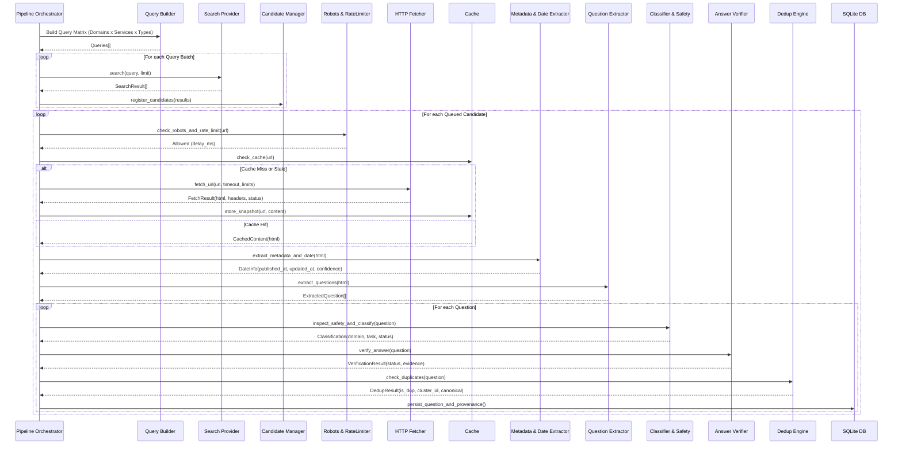
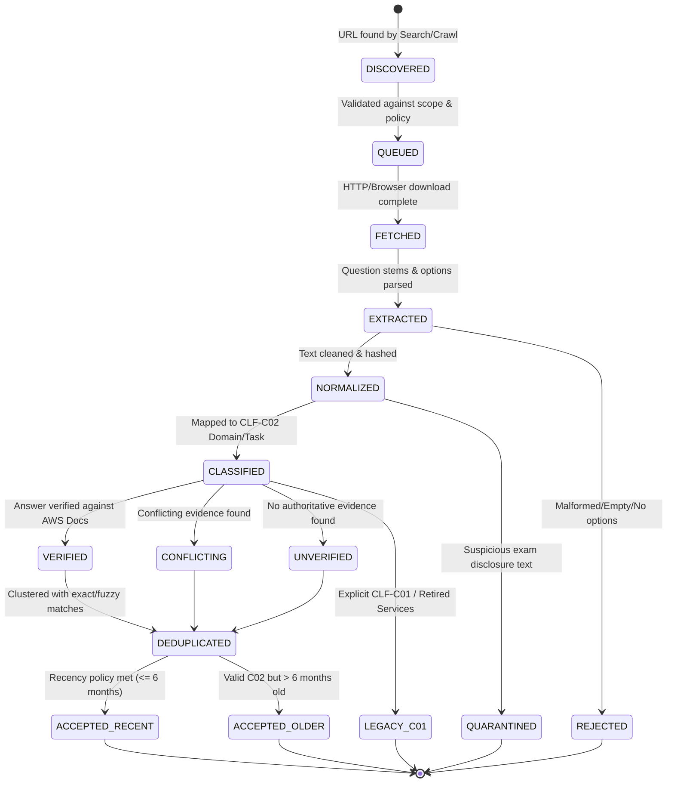
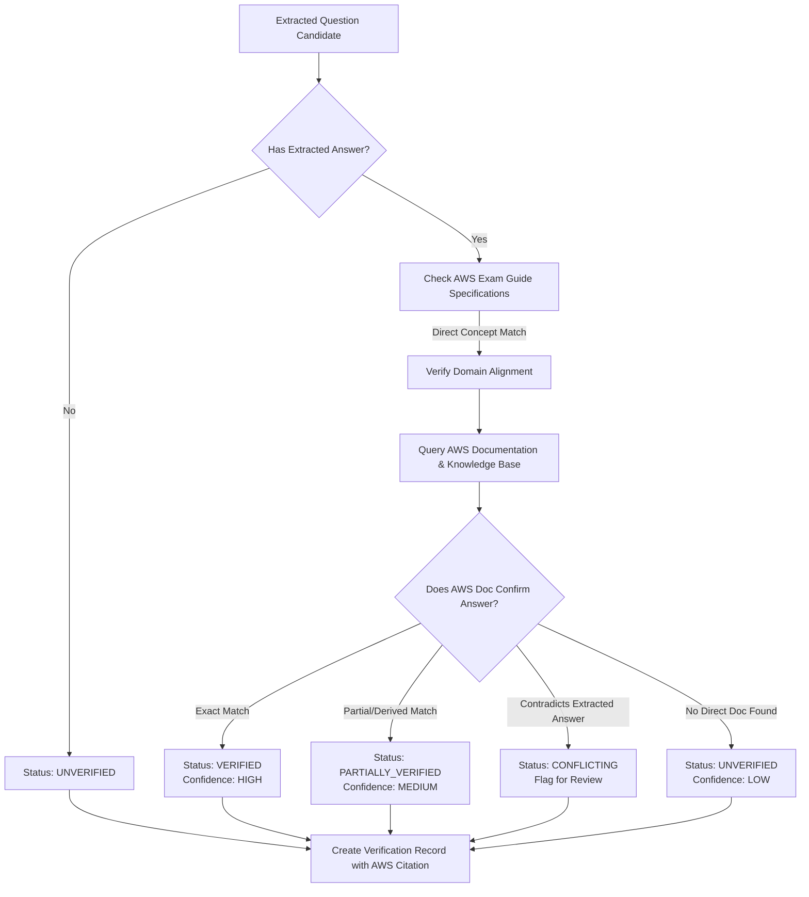
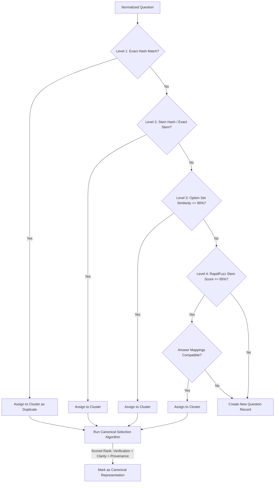
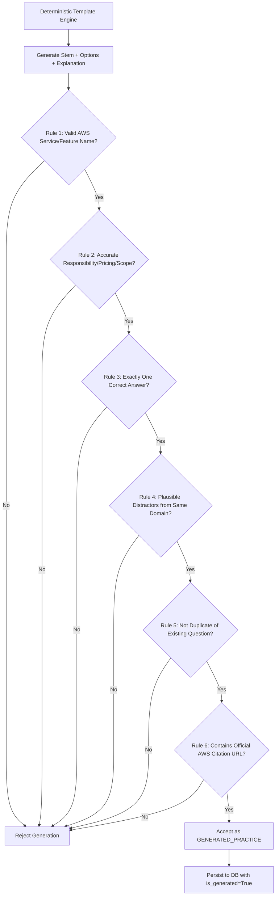

# DESIGN.md — Architecture & Technical Specifications

## 1. System Goals & Non-Goals

### Goals
- Discover publicly accessible AWS CLF-C02 practice and study material on the public internet.
- Dynamically determine recentness (default: last 6 calendar months from runtime).
- Extract structured single-choice, multiple-response, true/false, matching, and scenario questions.
- Maintain a strict distinction between **Recent Source Questions**, **Generated Practice Questions**, **Older Questions**, **Legacy CLF-C01**, and **Quarantined** items.
- Map questions to the official AWS CLF-C02 curriculum domains (1 through 4) and task statements.
- Verify extracted answers against official AWS documentation, whitepapers, and guides.
- Implement robust multi-level duplicate detection and clustering.
- Provide a responsive local Web UI (FastAPI + HTMX) and rich CLI (Click).
- Support offline study, quiz modes, weak-topic analytics, and multiple export formats (JSON, JSONL, CSV, MD, HTML).
- Ensure 100% free operation with zero mandatory paid services, APIs, or cloud infrastructure.
- Maintain total filesystem self-containment inside the project directory (`E:\`).

### Non-Goals
- Bypassing paywalls, login screens, or anti-bot protections.
- Downloading or storing confidential/leaked NDA-protected AWS exam dumps.
- Storing entire external websites or violating content licenses.
- Guaranteeing exam passing or predicting exact certification questions.
- Relying on external paid LLMs or paid search engines.

---

## 2. High-Level System Architecture

```mermaid
flowchart TD
    subgraph Discovery["Discovery Layer"]
        QM[Query Matrix Builder]
        SP[Search Providers]
        SR[Source Registry]
        SP --> |SearXNG (Optional)| SX[SearXNG Provider]
        SP --> |Direct Crawl| DS[Direct Source Provider]
        SP --> |RSS/Atom| RSS[RSS Provider]
        SP --> |XML Sitemap| SM[Sitemap Provider]
    end

    subgraph Fetching["Fetching & Caching Layer"]
        CM[Candidate Manager]
        HF[HTTP Fetcher (HTTPX)]
        BF[Browser Fetcher (Playwright - Opt)]
        RB[Robots & Policy Checker]
        RL[Per-Domain Rate Limiter]
        CA[Content-Addressed Cache]
    end

    subgraph Extraction["Extraction & Normalization Layer"]
        ME[Metadata Extractor]
        DE[Date Hierarchy Analyzer]
        QE[Question Extractor Engine]
        HE[HTML/DOM Parser]
        PE[PDF Parser (PyMuPDF)]
        QZ[Structured Quiz Parser]
    end

    subgraph Processing["Classification, Verification & Dedup"]
        NM[Text Normalizer]
        CS[Content Safety & Quarantine]
        CL[Curriculum Classifier]
        VR[Authoritative Answer Verifier]
        DD[Multi-Level Dedup Engine]
        QV[Data Quality Scorer]
    end

    subgraph Generation["Generated Practice Layer"]
        TG[Deterministic Template Generator]
        LG[Optional Local Reasoning Provider]
        GV[Fact & Distractor Validator]
    end

    subgraph Storage["Storage Layer"]
        DB[(SQLite 3 + WAL Mode)]
        FTS[FTS5 Full-Text Index]
        FS[Disk Snapshot Cache]
    end

    subgraph Interface["Interface & Delivery Layer"]
        WEB[Web UI (FastAPI + Jinja2 + HTMX)]
        CLI[Command Line Interface (Click)]
        EXP[Export Engine (JSON/CSV/MD/HTML)]
        SCH[Background Scheduler (APScheduler)]
    end

    QM --> SP
    SR --> SP
    SP --> CM
    CM --> RB --> RL --> HF
    HF --> CA
    CA --> ME --> DE
    CA --> HE --> QE
    CA --> PE --> QE
    CA --> QZ --> QE
    QE --> NM --> CS
    CS --> CL --> VR --> DD --> QV --> DB
    QV --> FTS
    TG --> GV --> DB
    DB --> WEB
    DB --> CLI
    DB --> EXP
    SCH --> QM
```

---

## 3. Ingestion Sequence Flow



---

## 4. Question Lifecycle State Machine



---

## 5. Answer Verification Flow



---

## 6. Duplicate-Clustering Flow



---

## 7. Dynamic Refresh Flow

```mermaid
flowchart TD
    TRIG[Refresh Triggered (CLI / Scheduled / Web)] --> WIN[Recompute 6-Month Date Window]
    WIN --> CUR[Check Official AWS Exam Guide for Updates]
    CUR --> ETAG{Curriculum Content Hash Changed?}
    ETAG --> |Yes| NCUR[Create New Curriculum Snapshot & Re-index Taxonomy]
    ETAG --> |No| DISCO[Run Incremental Source Discovery]
    NCUR --> DISCO

    DISCO --> HTTP_COND[Conditional HTTP Fetch using ETag & Last-Modified]
    HTTP_COND --> MOD{Page Modified?}
    MOD --> |304 Not Modified| SKP[Skip Extraction - Update Last Checked]
    MOD --> |200 OK (Content Changed)| REEXT[Re-extract Questions]

    REEXT --> DEDUP[Re-run Duplicate Clustering on Changed Set]
    DEDUP --> RECALC[Recalculate Dataset Recency Statuses]
    SKP --> RECALC
    RECALC --> AUDIT[Run Automated Dataset Audit]
    AUDIT --> RPT[Generate research_report.json & .html]
```

---

## 8. Generated-Question Validation Flow



---

## 9. Storage & Data Management
- **SQLite Database**: File at `data/db/clf_c02.db`. Configured with `PRAGMA journal_mode=WAL`, `PRAGMA synchronous=NORMAL`, and `PRAGMA foreign_keys=ON`.
- **FTS5 Full-Text Search**: Virtual table `questions_fts` indexing stem, options, explanation, services, topics, and domains for millisecond query performance.
- **Content-Addressed Cache**: `data/cache/pages/{url_hash}/{content_hash}` storing raw HTTP response bodies and metadata headers for zero-waste incremental runs.
- **Curriculum Cache**: `data/cache/curriculum/` for official PDF/HTML guides.
- **Log Files**: `data/logs/` for structured JSON and console logs.
- **Exports**: `data/exports/` for JSON, JSONL, CSV, Markdown, and HTML reports.
