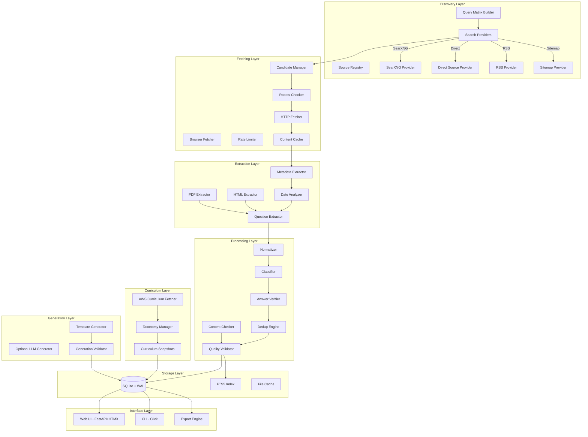
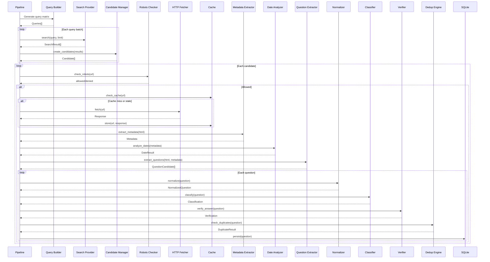
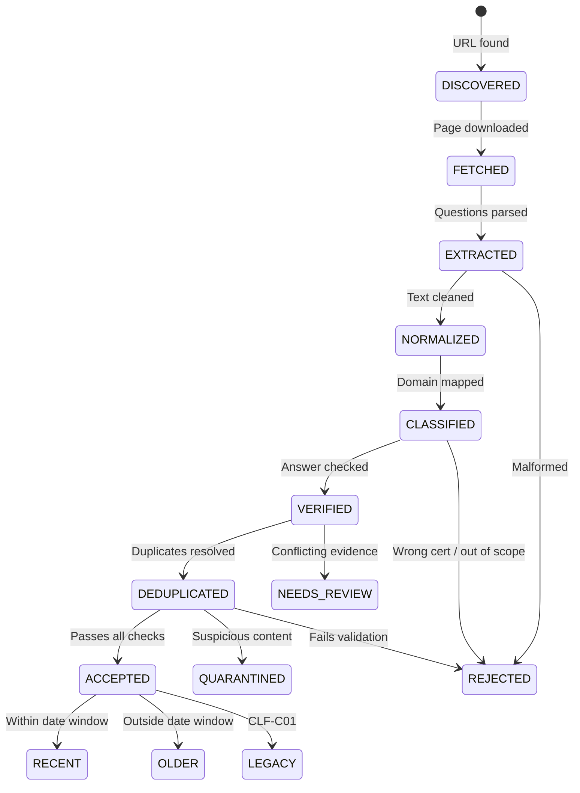
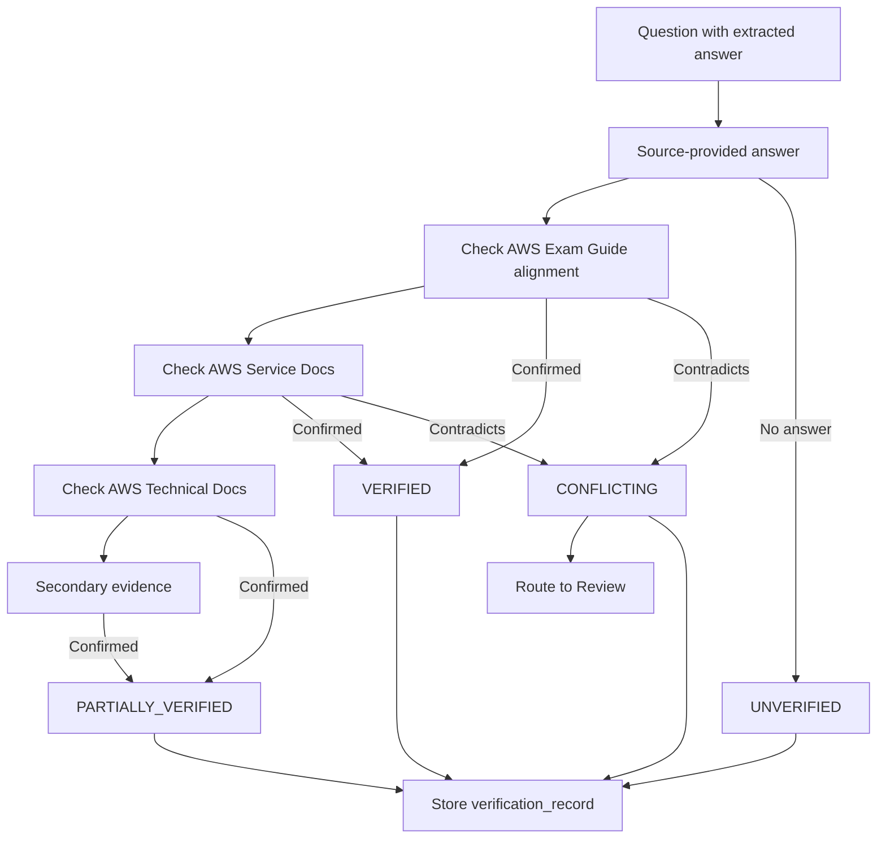
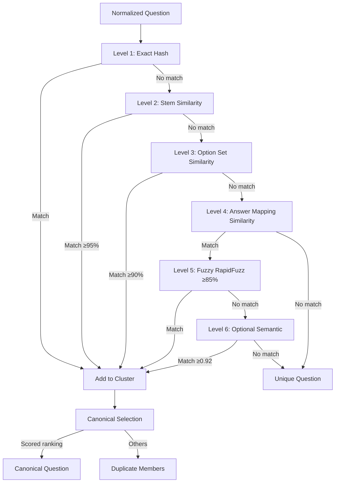
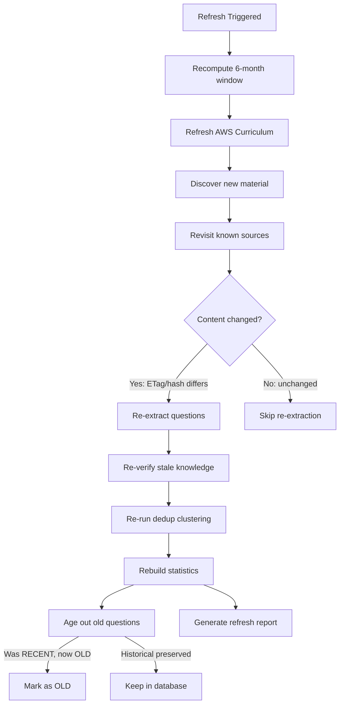
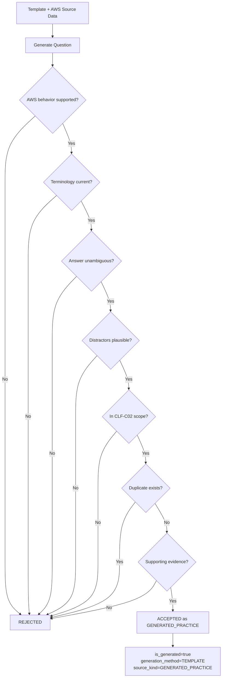

# CLF-C02 Recent Practice Question Researcher — Implementation Plan

## Goal

Build a completely free, local-first application that discovers publicly accessible AWS CLF-C02 practice questions from the internet, determines recency, extracts and validates questions, maps them to the current curriculum, verifies answers against authoritative AWS sources, detects duplicates, stores full provenance, and provides a searchable study/quiz interface. Target: 1,000 unique usable recent public practice questions (honest count, never padded).

**Repository location**: `e:\Anti Gravity (Projects)\question finder`
**Repository state**: Empty (greenfield). No existing code, no git history.

---

## CRITICAL: Self-Containment Policy

> [!CAUTION]
> **NOTHING touches the C: drive.** Every single artifact of this project — source code, virtual environment, pip download cache, Playwright browsers, database, content cache, Docker volumes, HTMX library, static assets, test data, logs, exports — MUST reside within:
>
> ```
> e:\Anti Gravity (Projects)\question finder\
> ```
>
> This is a **hard constraint** enforced at every phase.

### How Self-Containment Is Achieved

| Artifact | Location | Mechanism |
|---|---|---|
| Python virtual environment | `.venv\` | `python -m venv .venv` from project root |
| pip download cache | `.pip-cache\` | `PIP_CACHE_DIR` env var / `--cache-dir` flag |
| pip installed packages | `.venv\Lib\site-packages\` | Installed into venv, not global |
| Playwright browsers | `.playwright\` | `PLAYWRIGHT_BROWSERS_PATH` env var |
| SQLite database | `data\db\clf_c02.db` | Config-driven path |
| Content cache | `data\cache\` | Config-driven path |
| Curriculum cache | `data\cache\curriculum\` | Config-driven path |
| Exports | `data\exports\` | Config-driven path |
| Logs | `data\logs\` | Config-driven path |
| HTMX JS library | `app\web\static\vendor\htmx.min.js` | Downloaded once into project |
| Docker Compose files | `docker-compose.yml`, `Dockerfile` | Project root |
| Docker volumes | Bind-mount to `.\data\`, `.\config\` | Relative paths in compose file |
| Test fixtures | `tests\fixtures\` | In project |
| Schemas | `schemas\` | In project |
| Configuration | `config\` | In project |
| Agent rules/skills | `.agents\` | In project |

### Setup Script Enforces This

A `scripts\setup.ps1` (Windows) and `scripts/setup.sh` (Linux/macOS) will:

1. Create `.venv` inside the project folder
2. Set `PIP_CACHE_DIR` to `.pip-cache\` inside the project folder
3. Install all Python dependencies into the local `.venv`
4. Set `PLAYWRIGHT_BROWSERS_PATH` to `.playwright\` inside the project folder
5. Download HTMX JS to `app\web\static\vendor\`
6. Create all `data\` subdirectories
7. Initialize the database at `data\db\clf_c02.db`

```powershell
# scripts\setup.ps1 — Windows PowerShell
$ProjectRoot = Split-Path -Parent $PSScriptRoot
$env:PIP_CACHE_DIR = "$ProjectRoot\.pip-cache"
$env:PLAYWRIGHT_BROWSERS_PATH = "$ProjectRoot\.playwright"

# Create venv locally
python -m venv "$ProjectRoot\.venv"
& "$ProjectRoot\.venv\Scripts\Activate.ps1"

# Install deps with local cache
pip install --cache-dir "$ProjectRoot\.pip-cache" -e ".[dev]"

# Optional: install Playwright browsers locally
if (pip show playwright 2>$null) {
    playwright install chromium
}

# Download HTMX locally
$htmxDir = "$ProjectRoot\app\web\static\vendor"
New-Item -ItemType Directory -Force -Path $htmxDir | Out-Null
Invoke-WebRequest -Uri "https://unpkg.com/htmx.org@2.0.11/dist/htmx.min.js" `
    -OutFile "$htmxDir\htmx.min.js"

# Create data directories
@("data\db", "data\cache\pages", "data\cache\curriculum",
  "data\exports", "data\logs") | ForEach-Object {
    New-Item -ItemType Directory -Force -Path "$ProjectRoot\$_" | Out-Null
}

Write-Host "Setup complete. Everything is inside: $ProjectRoot"
```

### `.gitignore` Covers Local Artifacts

```gitignore
.venv/
.pip-cache/
.playwright/
data/db/
data/cache/
data/logs/
data/exports/
*.db
*.db-wal
*.db-shm
__pycache__/
*.pyc
.env
```

---

## Architecture Overview



### Ingestion Sequence



### Question Lifecycle



### Verification Flow



### Duplicate-Clustering Flow



### Refresh Flow



### Generated-Question Validation Flow



---

## Open Questions

> [!IMPORTANT]
> 1. **Python version**: System has Python 3.13. Target 3.11+ compatibility or 3.13-only?
> 2. **Git init**: Should I run `git init` in the project folder and create initial commits per phase?
> 3. **Phase execution**: Execute all 12 phases in one continuous run, or review after each macro-batch?
> 4. **SearXNG**: Do you have a SearXNG instance, or should Docker Compose be the way to spin one up?

---

## Proposed Changes

The project is greenfield. Every file below is **[NEW]**.

---

### Complete Project File Tree

```
e:\Anti Gravity (Projects)\question finder\
│
├── IMPLEMENTATION_PLAN.md          ← This file
├── AGENTS.md
├── DESIGN.md
├── PROJECT_SPEC.md
├── DATA_POLICY.md
├── SECURITY.md
├── README.md
├── CONTRIBUTING.md
├── CHANGELOG.md
│
├── pyproject.toml
├── .gitignore
├── .env.example
├── Dockerfile
├── docker-compose.yml
│
├── .agents/
│   ├── rules/
│   │   ├── architecture.md
│   │   ├── python.md
│   │   ├── database.md
│   │   ├── web-research.md
│   │   ├── provenance.md
│   │   ├── security.md
│   │   ├── testing.md
│   │   └── ux.md
│   └── skills/
│       ├── research-pipeline/
│       │   └── SKILL.md
│       ├── question-extraction/
│       │   └── SKILL.md
│       ├── answer-verification/
│       │   └── SKILL.md
│       ├── deduplication/
│       │   └── SKILL.md
│       └── dataset-audit/
│           └── SKILL.md
│
├── config/
│   ├── settings.yaml
│   ├── sources.yaml
│   ├── queries.yaml
│   ├── taxonomy.yaml
│   └── rejection_rules.yaml
│
├── schemas/
│   └── question.schema.json
│
├── scripts/
│   ├── setup.ps1                   ← Windows setup (self-contained)
│   └── setup.sh                    ← Linux/macOS setup (self-contained)
│
├── data/                           ← ALL runtime data here (gitignored)
│   ├── db/
│   │   └── clf_c02.db
│   ├── cache/
│   │   ├── pages/
│   │   └── curriculum/
│   ├── exports/
│   └── logs/
│
├── .venv/                          ← Python venv (gitignored)
├── .pip-cache/                     ← pip download cache (gitignored)
├── .playwright/                    ← Playwright browsers (gitignored)
│
├── app/
│   ├── __init__.py
│   ├── main.py
│   │
│   ├── config/
│   │   ├── __init__.py
│   │   └── settings.py
│   │
│   ├── core/
│   │   ├── __init__.py
│   │   ├── exceptions.py
│   │   ├── logging.py
│   │   ├── date_window.py
│   │   ├── types.py
│   │   └── paths.py               ← Central path resolver (project-root-relative)
│   │
│   ├── db/
│   │   ├── __init__.py
│   │   ├── engine.py
│   │   ├── models/
│   │   │   ├── __init__.py
│   │   │   ├── base.py
│   │   │   ├── research.py
│   │   │   ├── source.py
│   │   │   ├── question.py
│   │   │   ├── curriculum.py
│   │   │   ├── verification.py
│   │   │   ├── dedup.py
│   │   │   ├── generation.py
│   │   │   ├── audit.py
│   │   │   └── quiz.py
│   │   ├── repositories/
│   │   │   ├── __init__.py
│   │   │   ├── question_repo.py
│   │   │   ├── source_repo.py
│   │   │   ├── candidate_repo.py
│   │   │   ├── curriculum_repo.py
│   │   │   ├── verification_repo.py
│   │   │   ├── dedup_repo.py
│   │   │   ├── audit_repo.py
│   │   │   └── quiz_repo.py
│   │   ├── migrations/
│   │   │   └── __init__.py
│   │   └── fts.py
│   │
│   ├── curriculum/
│   │   ├── __init__.py
│   │   ├── fetcher.py
│   │   ├── parser.py
│   │   ├── snapshot.py
│   │   └── taxonomy.py
│   │
│   ├── discovery/
│   │   ├── __init__.py
│   │   ├── providers/
│   │   │   ├── __init__.py
│   │   │   ├── base.py
│   │   │   ├── searxng.py
│   │   │   ├── direct.py
│   │   │   ├── rss.py
│   │   │   └── sitemap.py
│   │   ├── query_builder.py
│   │   └── candidate_manager.py
│   │
│   ├── fetching/
│   │   ├── __init__.py
│   │   ├── http.py
│   │   ├── browser.py
│   │   ├── robots.py
│   │   ├── cache.py
│   │   ├── rate_limit.py
│   │   └── url.py
│   │
│   ├── extraction/
│   │   ├── __init__.py
│   │   ├── metadata.py
│   │   ├── dates.py
│   │   ├── html.py
│   │   ├── quiz.py
│   │   └── pdf.py
│   │
│   ├── questions/
│   │   ├── __init__.py
│   │   ├── types.py
│   │   ├── normalize.py
│   │   ├── validate.py
│   │   └── classify.py
│   │
│   ├── verification/
│   │   ├── __init__.py
│   │   ├── verifier.py
│   │   ├── evidence.py
│   │   ├── knowledge.py
│   │   └── c01_detector.py
│   │
│   ├── deduplication/
│   │   ├── __init__.py
│   │   ├── engine.py
│   │   ├── hashing.py
│   │   ├── clustering.py
│   │   └── canonical.py
│   │
│   ├── generation/
│   │   ├── __init__.py
│   │   ├── generator.py
│   │   ├── templates.py
│   │   ├── template_data/
│   │   │   ├── __init__.py
│   │   │   ├── cloud_concepts.py
│   │   │   ├── security.py
│   │   │   ├── technology.py
│   │   │   └── billing.py
│   │   ├── validator.py
│   │   └── local_llm.py
│   │
│   ├── pipeline/
│   │   ├── __init__.py
│   │   ├── orchestrator.py
│   │   ├── stages.py
│   │   ├── checkpoint.py
│   │   └── scheduler.py
│   │
│   ├── analytics/
│   │   ├── __init__.py
│   │   ├── stats.py
│   │   ├── coverage.py
│   │   └── user_analytics.py
│   │
│   ├── export/
│   │   ├── __init__.py
│   │   ├── exporter.py
│   │   ├── formats.py
│   │   └── report.py
│   │
│   ├── content_safety/
│   │   ├── __init__.py
│   │   └── classifier.py
│   │
│   ├── web/
│   │   ├── __init__.py
│   │   ├── routes/
│   │   │   ├── __init__.py
│   │   │   ├── dashboard.py
│   │   │   ├── questions.py
│   │   │   ├── quiz.py
│   │   │   ├── sources.py
│   │   │   ├── research.py
│   │   │   ├── audit.py
│   │   │   └── settings.py
│   │   ├── templates/
│   │   │   ├── base.html
│   │   │   ├── dashboard.html
│   │   │   ├── questions/
│   │   │   │   ├── list.html
│   │   │   │   ├── detail.html
│   │   │   │   └── partials/
│   │   │   │       ├── question_card.html
│   │   │   │       └── filter_bar.html
│   │   │   ├── quiz/
│   │   │   │   ├── setup.html
│   │   │   │   ├── question.html
│   │   │   │   ├── result.html
│   │   │   │   └── review.html
│   │   │   ├── sources/
│   │   │   │   └── list.html
│   │   │   ├── research/
│   │   │   │   ├── runs.html
│   │   │   │   └── detail.html
│   │   │   ├── audit/
│   │   │   │   └── log.html
│   │   │   └── settings/
│   │   │       └── index.html
│   │   └── static/
│   │       ├── css/
│   │       │   └── style.css
│   │       ├── js/
│   │       │   └── app.js
│   │       └── vendor/
│   │           └── htmx.min.js    ← Downloaded locally, not CDN
│   │
│   └── cli/
│       ├── __init__.py
│       └── main.py
│
├── tests/
│   ├── __init__.py
│   ├── conftest.py
│   ├── fixtures/
│   │   ├── valid_recent_source.html
│   │   ├── recent_updated_source.html
│   │   ├── old_source.html
│   │   ├── clf_c01_source.html
│   │   ├── missing_date_source.html
│   │   ├── duplicate_source_a.html
│   │   ├── duplicate_source_b.html
│   │   ├── reordered_options.html
│   │   ├── malformed_quiz.html
│   │   ├── multiple_response.html
│   │   ├── incorrect_answer.html
│   │   ├── conflicting_evidence.html
│   │   ├── suspicious_content.html
│   │   ├── generated_question.json
│   │   ├── changed_snapshot_v1.html
│   │   ├── changed_snapshot_v2.html
│   │   ├── robots_denied.txt
│   │   └── oversized.html
│   ├── unit/
│   │   ├── __init__.py
│   │   ├── test_url.py
│   │   ├── test_query_builder.py
│   │   ├── test_dates.py
│   │   ├── test_date_window.py
│   │   ├── test_html_extraction.py
│   │   ├── test_option_extraction.py
│   │   ├── test_answer_extraction.py
│   │   ├── test_normalize.py
│   │   ├── test_classify.py
│   │   ├── test_dedup.py
│   │   ├── test_source_scoring.py
│   │   ├── test_validate.py
│   │   ├── test_c01_detector.py
│   │   └── test_content_safety.py
│   ├── integration/
│   │   ├── __init__.py
│   │   ├── test_database.py
│   │   ├── test_fts5.py
│   │   ├── test_fetcher.py
│   │   ├── test_cache.py
│   │   ├── test_source_registry.py
│   │   ├── test_pipeline_checkpoint.py
│   │   └── test_verification.py
│   └── e2e/
│       ├── __init__.py
│       └── test_full_pipeline.py
│
└── docs/
    └── architecture.md
```

---

### Phase 0 — Repository Foundation & Documentation

---

#### [NEW] `AGENTS.md`
Concise project constitution (~80 lines). Defines mission, engineering principles, mandatory content rules, development rules. References `.agents/rules/` for details.

```markdown
# AGENTS.md — CLF-C02 Recent Practice Question Researcher

## Mission
Build a local-first CLF-C02 public-practice research and study application.
All artifacts reside within the project directory. No external disk dependencies.

## Engineering Principles
- correctness over speed
- provenance over convenience
- deterministic processing before probabilistic processing
- no hidden transformations
- no fabricated facts, provenance, dates, or answers
- no silent data corruption
- incremental processing
- reproducible research
- test before declaring completion
- self-contained: everything inside project root

## Mandatory Content Rules
- never claim generated questions are real exam questions
- never fabricate a publication date
- never fabricate an answer
- preserve provenance and evidence
- separate sourced and generated content
- do not bypass authentication, CAPTCHAs, access controls, or anti-bot mechanisms

## Development Rules
- type annotations on all functions
- Pydantic validation for all external data
- structured logging (no print())
- tests for every component
- small focused modules
- configuration-driven behavior
- no secrets in code
- all paths relative to project root

## Detailed rules → .agents/rules/
## Detailed procedures → .agents/skills/
```

#### [NEW] `DESIGN.md`
Full architectural document with all 7 Mermaid diagrams (system architecture, ingestion sequence, question lifecycle, verification flow, duplicate-clustering flow, refresh flow, generated-question validation flow). ~500 lines.

#### [NEW] `PROJECT_SPEC.md`
Functional requirements FR-001 through FR-017, each with requirement, reason, and acceptance condition. ~400 lines.

#### [NEW] `DATA_POLICY.md`
Source categories, date policy, provenance policy, question categories, generated-content policy, duplicate policy, rejection policy, licensing metadata, attribution, retention. ~200 lines.

#### [NEW] `SECURITY.md`
Secrets management, content isolation, request limits, browser sandboxing, URL validation, SSRF protections, redirect limits, content-size limits. ~150 lines.

#### [NEW] `README.md`
Full README including self-contained install instructions for Windows and Linux/macOS.

Key section:

```markdown
## Installation (Windows — Everything on E: drive)

```powershell
cd "e:\Anti Gravity (Projects)\question finder"
.\scripts\setup.ps1

# Or manually:
$env:PIP_CACHE_DIR = "$(Get-Location)\.pip-cache"
python -m venv .venv
.venv\Scripts\Activate.ps1
pip install --cache-dir .\.pip-cache -e ".[dev]"

clf doctor
clf init
clf curriculum refresh
```
```

#### [NEW] `CONTRIBUTING.md`, `CHANGELOG.md`

---

#### Agent Rules (`.agents/rules/`)

Each file 30–60 lines of stable invariants:

| File | Content |
|---|---|
| `architecture.md` | Module boundaries, dependency direction, no circular imports, async patterns |
| `python.md` | Type annotations, Pydantic models, structured logging, import conventions |
| `database.md` | SQLite WAL mode, foreign keys, FTS5 patterns, migration discipline |
| `web-research.md` | Rate limits, robots respect, no auth bypass, timeout enforcement |
| `provenance.md` | Every source question traceable, no fabricated dates/URLs/answers |
| `security.md` | SSRF protection, URL validation, content size limits, no secrets in code |
| `testing.md` | Fixtures over live web, pytest conventions, async test patterns |
| `ux.md` | Source vs. generated distinction visible everywhere, honest counts |

---

#### Agent Skills (`.agents/skills/`)

| Skill | Content |
|---|---|
| `research-pipeline/SKILL.md` | Step-by-step procedure for running a full research cycle |
| `question-extraction/SKILL.md` | Extraction workflow: HTML → structured → quiz → heuristics |
| `answer-verification/SKILL.md` | Verification against AWS docs, evidence recording, conflict resolution |
| `deduplication/SKILL.md` | 6-level dedup procedure |
| `dataset-audit/SKILL.md` | Audit checklist: provenance, answers, dates, duplicates, C01 contamination |

---

### Phase 1 — Core Application Skeleton

---

#### [NEW] `pyproject.toml`

```toml
[build-system]
requires = ["setuptools>=75.0", "wheel"]
build-backend = "setuptools.backends._legacy:_Backend"

[project]
name = "clf-c02-researcher"
version = "0.1.0"
description = "CLF-C02 Recent Practice Question Researcher"
requires-python = ">=3.11"
dependencies = [
    "fastapi>=0.115.0",
    "pydantic>=2.10.0",
    "pydantic-settings>=2.6.0",
    "uvicorn[standard]>=0.34.0",
    "jinja2>=3.1.6",
    "sqlalchemy>=2.0.38",
    "aiosqlite>=0.21.0",
    "httpx>=0.28.0",
    "beautifulsoup4>=4.13.0",
    "lxml>=5.3.0",
    "trafilatura>=2.1.0",
    "dateparser>=1.2.0",
    "feedparser>=6.0.11",
    "rapidfuzz>=3.10.0",
    "pymupdf>=1.25.0",
    "apscheduler>=3.10.4,<4.0",
    "click>=8.1.8",
    "pyyaml>=6.0",
    "python-multipart>=0.0.9",
    "python-dateutil>=2.9.0",
]

[project.optional-dependencies]
browser = ["playwright>=1.40.0"]
dev = [
    "pytest>=8.3.0",
    "pytest-asyncio>=0.24.0",
    "pytest-cov",
    "ruff",
    "httpx",  # for test client
]

[project.scripts]
clf = "app.cli.main:cli"

[tool.pytest.ini_options]
asyncio_mode = "auto"
testpaths = ["tests"]

[tool.ruff]
line-length = 100
target-version = "py311"
```

#### [NEW] `app/core/paths.py` — Central Path Resolver

This is the key to self-containment. Every path in the application is computed relative to the project root:

```python
"""Central path resolver. All paths are relative to the project root.
Nothing ever references C:\\ or any location outside this tree."""

from pathlib import Path

# Project root: determined by walking up from this file
PROJECT_ROOT = Path(__file__).resolve().parent.parent.parent

# Data directories (runtime, gitignored)
DATA_DIR = PROJECT_ROOT / "data"
DB_DIR = DATA_DIR / "db"
CACHE_DIR = DATA_DIR / "cache"
PAGE_CACHE_DIR = CACHE_DIR / "pages"
CURRICULUM_CACHE_DIR = CACHE_DIR / "curriculum"
EXPORTS_DIR = DATA_DIR / "exports"
LOGS_DIR = DATA_DIR / "logs"

# Configuration
CONFIG_DIR = PROJECT_ROOT / "config"
SETTINGS_FILE = CONFIG_DIR / "settings.yaml"
SOURCES_FILE = CONFIG_DIR / "sources.yaml"
QUERIES_FILE = CONFIG_DIR / "queries.yaml"
TAXONOMY_FILE = CONFIG_DIR / "taxonomy.yaml"
REJECTION_RULES_FILE = CONFIG_DIR / "rejection_rules.yaml"

# Database
DEFAULT_DB_PATH = DB_DIR / "clf_c02.db"
DEFAULT_DB_URL = f"sqlite+aiosqlite:///{DEFAULT_DB_PATH}"

# Schemas
SCHEMAS_DIR = PROJECT_ROOT / "schemas"

# Web static
STATIC_DIR = PROJECT_ROOT / "app" / "web" / "static"
TEMPLATES_DIR = PROJECT_ROOT / "app" / "web" / "templates"

def ensure_data_dirs() -> None:
    """Create all data directories if they don't exist."""
    for d in [DB_DIR, PAGE_CACHE_DIR, CURRICULUM_CACHE_DIR, EXPORTS_DIR, LOGS_DIR]:
        d.mkdir(parents=True, exist_ok=True)
```

#### [NEW] `app/config/settings.py` — Pydantic Settings

```python
from pydantic import Field
from pydantic_settings import BaseSettings
from app.core.paths import SETTINGS_FILE, DEFAULT_DB_URL

class ResearchSettings(BaseSettings):
    months: int = 6
    recent_source_target: int = 1000
    total_study_target: int = 1000
    language: str = "en"
    date_policy: str = "RECENT_PUBLICATION_OR_SUBSTANTIAL_UPDATE"

class CrawlerSettings(BaseSettings):
    max_pages_per_run: int = 5000
    request_timeout_seconds: int = 20
    max_content_size_mb: int = 10
    max_concurrency: int = 8
    respect_robots: bool = True
    max_redirects: int = 5

class Settings(BaseSettings):
    database_url: str = DEFAULT_DB_URL
    research: ResearchSettings = Field(default_factory=ResearchSettings)
    crawler: CrawlerSettings = Field(default_factory=CrawlerSettings)
    # ... more sections loaded from config/settings.yaml
```

#### [NEW] `app/core/exceptions.py`

All 14 structured exception types:
```python
class CLFResearcherError(Exception): ...
class FetchError(CLFResearcherError): ...
class RobotsDeniedError(FetchError): ...
class RateLimitError(FetchError): ...
class ContentTooLargeError(FetchError): ...
class ParseError(CLFResearcherError): ...
class MetadataError(CLFResearcherError): ...
class DateResolutionError(CLFResearcherError): ...
class QuestionExtractionError(CLFResearcherError): ...
class ClassificationError(CLFResearcherError): ...
class VerificationError(CLFResearcherError): ...
class DeduplicationError(CLFResearcherError): ...
class PersistenceError(CLFResearcherError): ...
class SSRFError(CLFResearcherError): ...
class ConfigurationError(CLFResearcherError): ...
```

#### [NEW] `app/core/date_window.py`

```python
from datetime import date
from dateutil.relativedelta import relativedelta

def compute_research_window(months: int = 6) -> tuple[date, date]:
    end_date = date.today()
    start_date = end_date - relativedelta(months=months)
    return start_date, end_date
```

#### [NEW] `app/core/types.py`

All shared enums: `QuestionType`, `QuestionStatus`, `SourceKind`, `DateConfidence`, `DatePolicy`, `RecentnessStatus`, `AnswerStatus`, `KnowledgeStatus`, `SourceTier`, `CandidateStatus`, `LegacyStatus`, `LicenseStatus`, `ContentSafetyStatus`.

#### [NEW] `app/core/logging.py`

Structured logging setup. Log files go to `data/logs/`. Console logs human-readable, file logs JSON-structured.

---

#### Database Schema

#### [NEW] `app/db/engine.py`

```python
from sqlalchemy.ext.asyncio import create_async_engine, async_sessionmaker
from sqlalchemy import event
from app.core.paths import DEFAULT_DB_URL

engine = create_async_engine(DEFAULT_DB_URL, echo=False)

@event.listens_for(engine.sync_engine, "connect")
def set_sqlite_pragma(dbapi_connection, connection_record):
    cursor = dbapi_connection.cursor()
    cursor.execute("PRAGMA journal_mode=WAL")
    cursor.execute("PRAGMA synchronous=NORMAL")
    cursor.execute("PRAGMA foreign_keys=ON")
    cursor.close()

AsyncSession = async_sessionmaker(engine, expire_on_commit=False)
```

#### [NEW] `app/db/models/` — All SQLAlchemy 2.0 Declarative Models

22 tables as specified in §47–49. Key tables:

- `research_runs` — run metadata
- `search_candidates` — URL pipeline
- `sources`, `source_pages`, `source_snapshots` — source tracking
- `questions`, `question_options`, `question_sources`, `question_topics`, `question_services` — question data
- `curriculum_snapshots`, `curriculum_domains`, `curriculum_tasks` — curriculum
- `verification_records` — answer verification
- `duplicate_clusters`, `duplicate_members` — dedup
- `rejection_records`, `audit_logs` — audit
- `user_quiz_sessions`, `user_answers` — quiz tracking

#### [NEW] `app/db/fts.py` — FTS5 Virtual Table

```python
FTS5_SETUP = """
CREATE VIRTUAL TABLE IF NOT EXISTS questions_fts USING fts5(
    stem, options_text, explanation, services, topics,
    domain_name, task_statement, source_title,
    content='questions', content_rowid='id'
);
"""
```

---

#### CLI Framework

#### [NEW] `app/cli/main.py`

Click CLI with all commands: `doctor`, `init`, `curriculum refresh`, `research`, `discover`, `crawl`, `extract`, `classify`, `verify`, `dedupe`, `audit`, `stats`, `export`, `quiz`, `refresh`, `serve`.

---

### Phase 2 — Curriculum Layer

| File | Purpose |
|---|---|
| `app/curriculum/fetcher.py` | Downloads CLF-C02 exam guide PDF from AWS, stores in `data/cache/curriculum/` |
| `app/curriculum/parser.py` | Extracts domains, tasks, services from PDF using PyMuPDF |
| `app/curriculum/snapshot.py` | Versioned curriculum snapshots with content hash comparison |
| `app/curriculum/taxonomy.py` | Service/concept/topic dictionaries for classification |

---

### Phase 3 — Discovery Layer

| File | Purpose |
|---|---|
| `app/discovery/providers/base.py` | `SearchProvider` ABC |
| `app/discovery/providers/searxng.py` | SearXNG JSON API (optional, graceful if unavailable) |
| `app/discovery/providers/direct.py` | Direct source crawl from registry |
| `app/discovery/providers/rss.py` | RSS/Atom feed discovery |
| `app/discovery/providers/sitemap.py` | XML sitemap parsing |
| `app/discovery/query_builder.py` | Query matrix from curriculum × query templates |
| `app/discovery/candidate_manager.py` | Candidate URL pipeline + dedup by canonical URL |

---

### Phase 4 — Fetching Layer

| File | Purpose |
|---|---|
| `app/fetching/url.py` | URL canonicalization + SSRF validation |
| `app/fetching/robots.py` | robots.txt parsing + caching |
| `app/fetching/rate_limit.py` | Per-domain async rate limiter |
| `app/fetching/http.py` | `HttpFetcher` with httpx async |
| `app/fetching/browser.py` | Optional `BrowserFetcher` with Playwright |
| `app/fetching/cache.py` | Content-addressed local cache in `data/cache/pages/` |

---

### Phase 5 — Extraction Layer

| File | Purpose |
|---|---|
| `app/extraction/metadata.py` | Page metadata (title, author, schema.org, OG tags) |
| `app/extraction/dates.py` | 10-level date extraction hierarchy |
| `app/extraction/html.py` | HTML question extraction (structured, semantic, pattern, table) |
| `app/extraction/quiz.py` | Specialized quiz framework extraction |
| `app/extraction/pdf.py` | PDF question extraction using PyMuPDF |

---

### Phase 6 — Question Processing

| File | Purpose |
|---|---|
| `app/questions/types.py` | Question Pydantic models |
| `app/questions/normalize.py` | Text normalization + hashing |
| `app/questions/validate.py` | Structural validation |
| `app/questions/classify.py` | CLF-C02 domain/task classification |
| `app/content_safety/classifier.py` | Suspicious content detection |
| `app/verification/c01_detector.py` | CLF-C01 legacy detection |

---

### Phase 7 — Answer Verification

| File | Purpose |
|---|---|
| `app/verification/verifier.py` | Answer verification engine |
| `app/verification/evidence.py` | Evidence collection from AWS docs |
| `app/verification/knowledge.py` | Current-knowledge checking |

---

### Phase 8 — Deduplication

| File | Purpose |
|---|---|
| `app/deduplication/engine.py` | 6-level duplicate detection |
| `app/deduplication/hashing.py` | Exact + fuzzy hashing |
| `app/deduplication/clustering.py` | Duplicate cluster management |
| `app/deduplication/canonical.py` | Canonical question selection |

---

### Phase 9 — Question Generation

| File | Purpose |
|---|---|
| `app/generation/generator.py` | `QuestionGenerator` interface |
| `app/generation/templates.py` | `TemplateGenerator` — deterministic, evidence-backed |
| `app/generation/template_data/*.py` | 4 template families (cloud_concepts, security, technology, billing) |
| `app/generation/validator.py` | Generated question validation |
| `app/generation/local_llm.py` | Optional `LocalReasoningProvider` |

---

### Phase 10 — Pipeline + Web UI

#### Pipeline

| File | Purpose |
|---|---|
| `app/pipeline/orchestrator.py` | Main research pipeline (21 steps with checkpointing) |
| `app/pipeline/stages.py` | Pipeline stage definitions |
| `app/pipeline/checkpoint.py` | Stage checkpointing + resume |
| `app/pipeline/scheduler.py` | APScheduler integration |

#### Web UI (FastAPI + Jinja2 + HTMX)

| Route File | Page |
|---|---|
| `dashboard.py` | Dashboard — all counters, domain charts, research window |
| `questions.py` | Question bank — FTS5 search, filters, detail view |
| `quiz.py` | Quiz — 10 modes, option randomization, results, review |
| `sources.py` | Source management — health metrics, enable/disable |
| `research.py` | Research runs — history, logs, statistics |
| `audit.py` | Audit log — rejections, admin controls |
| `settings.py` | Settings — configuration view |

Templates use **locally-downloaded HTMX** from `app/web/static/vendor/htmx.min.js` (not CDN).

```html
<!-- base.html -->
<script src="{{ url_for('static', path='vendor/htmx.min.js') }}"></script>
```

---

### Phase 11 — Export, Analytics, Docker

| File | Purpose |
|---|---|
| `app/export/formats.py` | JSON, JSONL, CSV, Markdown, HTML export |
| `app/export/report.py` | Research report generation |
| `app/analytics/stats.py` | Dataset statistics |
| `app/analytics/coverage.py` | Domain coverage analysis |
| `app/analytics/user_analytics.py` | Quiz performance + weak topics |
| `schemas/question.schema.json` | JSON Schema for export |

#### [NEW] `Dockerfile`

```dockerfile
FROM python:3.13-slim
WORKDIR /app
COPY pyproject.toml .
RUN pip install --no-cache-dir -e .
COPY . .
RUN mkdir -p data/db data/cache/pages data/cache/curriculum data/exports data/logs
EXPOSE 8000
CMD ["uvicorn", "app.main:app", "--host", "0.0.0.0", "--port", "8000"]
```

#### [NEW] `docker-compose.yml`

```yaml
services:
  app:
    build: .
    ports:
      - "8000:8000"
    volumes:
      - ./data:/app/data
      - ./config:/app/config
    environment:
      - DATABASE_URL=sqlite+aiosqlite:///data/db/clf_c02.db

  searxng:
    image: searxng/searxng:latest
    ports:
      - "8080:8080"
    profiles:
      - search
    # Only starts with: docker compose --profile search up
```

All Docker volumes bind-mount to subdirectories of the project folder. No named volumes that would go to C: drive Docker storage.

---

### Phase 12 — Testing

#### Test Fixtures (`tests/fixtures/`)

17 fixture files as specified in §77 (valid recent source, old source, CLF-C01, duplicates, malformed, multi-response, suspicious content, robots denied, oversized, etc.)

#### Test Suites

| Suite | Files | Coverage |
|---|---|---|
| `tests/unit/` | 15 test files | URL normalization, query building, dates, extraction, normalization, classification, dedup, validation, C01 detection, content safety |
| `tests/integration/` | 7 test files | SQLite schema, FTS5, fetcher, cache, source registry, pipeline checkpoints, verification |
| `tests/e2e/` | 1 test file | Full pipeline: fixture → fetch → extract → classify → verify → dedupe → persist → search → quiz |

#### [NEW] `tests/conftest.py`

Shared fixtures:
- In-memory async SQLite database sessions
- Mock HTTP server for fetcher tests
- Fixture file loader
- All test database paths use `data/db/test_*.db` within project root (never `C:\temp`)

```python
import tempfile
from app.core.paths import PROJECT_ROOT

@pytest.fixture
def tmp_db_path():
    """Temporary database inside the project data directory."""
    test_db_dir = PROJECT_ROOT / "data" / "db"
    test_db_dir.mkdir(parents=True, exist_ok=True)
    return test_db_dir / f"test_{uuid4().hex[:8]}.db"
```

---

## File Count Summary

| Category | Files | Lines (approx) |
|---|---|---|
| Documentation (MD) | 15 | ~3,500 |
| Agent rules + skills | 13 | ~800 |
| Configuration (YAML/JSON) | 6 | ~900 |
| Application code (Python) | ~80 | ~15,000 |
| Templates (HTML/Jinja2) | ~20 | ~3,000 |
| Static assets (CSS/JS + vendor) | 4 | ~600 |
| Scripts (setup) | 2 | ~100 |
| Test code | ~25 | ~5,000 |
| Infrastructure (Docker, pyproject) | 4 | ~150 |
| **Total** | **~169** | **~30,050** |

---

## Verification Plan

### Automated Tests

```powershell
# From project root on Windows:
cd "e:\Anti Gravity (Projects)\question finder"
.venv\Scripts\Activate.ps1

# Run all tests
pytest tests/ -v --tb=short

# Run specific suites
pytest tests/unit/ -v
pytest tests/integration/ -v
pytest tests/e2e/ -v

# With coverage
pytest tests/ --cov=app --cov-report=term-missing
```

### CLI Verification

```powershell
clf doctor              # Health check — verifies all paths are in project root
clf init                # Initialize database at data\db\clf_c02.db
clf curriculum refresh  # Fetch & store CLF-C02 curriculum
clf research --months 6 --recent-source-target 1000
clf audit               # Full dataset audit
clf stats               # Dataset statistics
clf export --format json --output data\exports\
clf serve               # Start web UI at http://127.0.0.1:8000
```

### Manual Verification

1. **Self-containment**: Verify no files created on `C:\` — check `%LOCALAPPDATA%`, `%APPDATA%`, `C:\Users\` for any new artifacts
2. **Database**: Open `data\db\clf_c02.db` with SQLite CLI, verify schema, FTS5, foreign keys
3. **Web UI**: Dashboard → Question Bank → Question Detail → Quiz → Sources → Audit
4. **Quiz correctness**: Option randomization preserves correct answers
5. **Source/generated distinction**: Badges visible everywhere
6. **Date window**: Dashboard shows computed dynamic dates
7. **Docker**: `docker compose up` serves app at `localhost:8000`, volumes bind to `.\data\`

### Acceptance Test Pipeline

```
fixture sources → discovery → fetch → extraction → date verification
→ classification → answer verification → dedupe → database → FTS
→ UI → quiz → export → audit
```

Verify:
- [ ] All data files exist only under `e:\Anti Gravity (Projects)\question finder\`
- [ ] Duplicates collapsed correctly
- [ ] Multi-response answer mappings survive shuffling
- [ ] Generated questions remain marked generated
- [ ] Old questions NOT classified as recent
- [ ] C01 material NOT in C02 recent pool
- [ ] Provenance preserved for all source questions
- [ ] No paid services required
- [ ] All counters honest (source vs. generated separate)

---

## Execution Strategy

### Batch 1 — Phases 0–4: Foundation → Fetching
Repository, docs, config, database, CLI, curriculum, discovery, fetching.
**Checkpoint**: `clf doctor` and `clf init` work, database created at `data\db\clf_c02.db`, unit tests pass.

### Batch 2 — Phases 5–9: Extraction → Generation
Extraction, question processing, verification, deduplication, generation.
**Checkpoint**: Fixture-based pipeline runs end-to-end, questions in DB, FTS5 search works.

### Batch 3 — Phases 10–12: UI → Testing → Docker
Web interface, export, audit, Docker, full test suite.
**Checkpoint**: Full app running, quiz functional, all tests pass, Docker compose works.

---

## Key Technical Decisions

| Decision | Choice | Rationale |
|---|---|---|
| All paths | Relative to project root via `app/core/paths.py` | Self-containment on E: drive |
| pip cache | `.pip-cache/` in project root | No downloads to C: |
| Playwright browsers | `.playwright/` in project root via env var | No downloads to C: |
| HTMX | Local file in `static/vendor/` | No CDN dependency, no external fetch |
| Database | `data/db/clf_c02.db` | Project-local SQLite |
| Test databases | `data/db/test_*.db` | No system temp directories |
| Log files | `data/logs/` | Project-local logging |
| Docker volumes | Bind-mount `./data`, `./config` | No named volumes on C: drive |
| Python venv | `.venv/` in project root | Not in `C:\Users\...\` |
| Setup script | Sets `PIP_CACHE_DIR`, `PLAYWRIGHT_BROWSERS_PATH` | Environment enforces self-containment |
